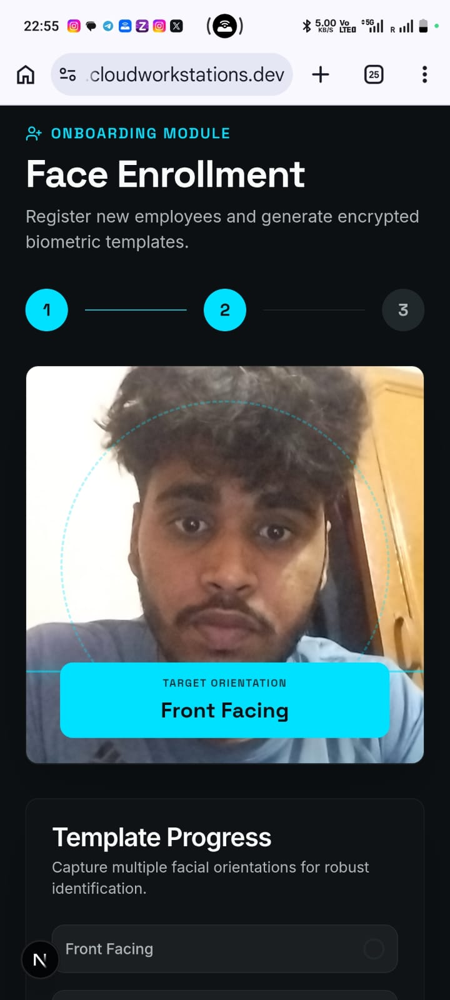
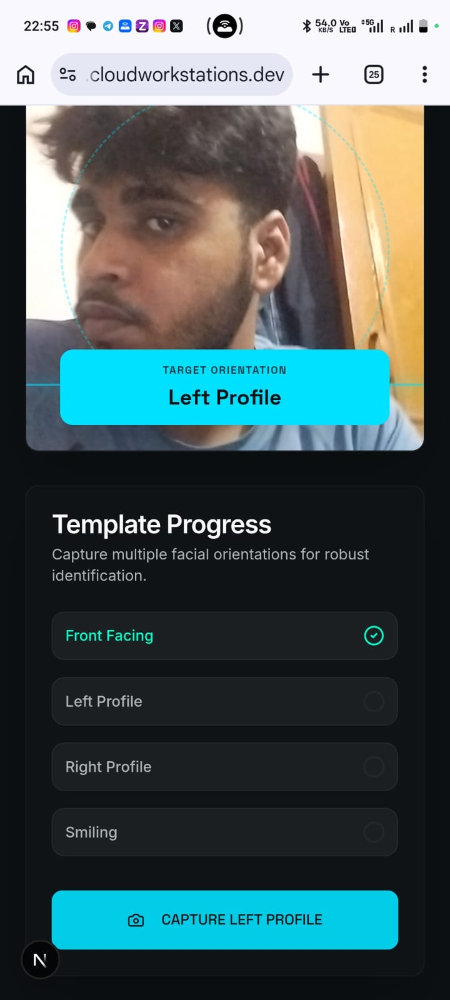
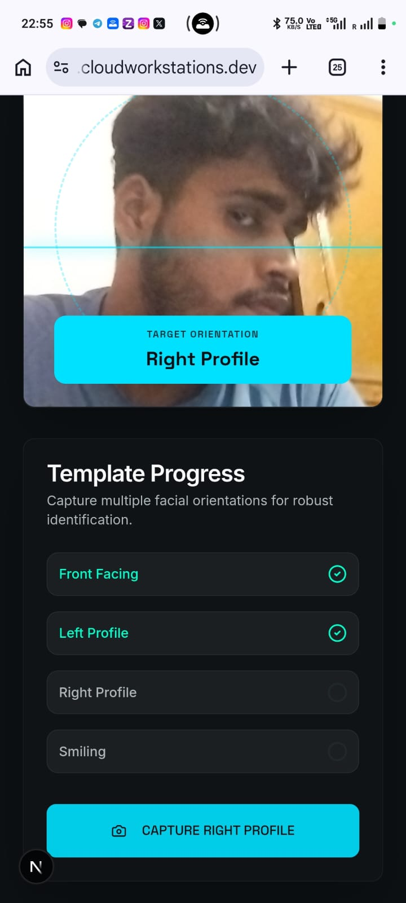
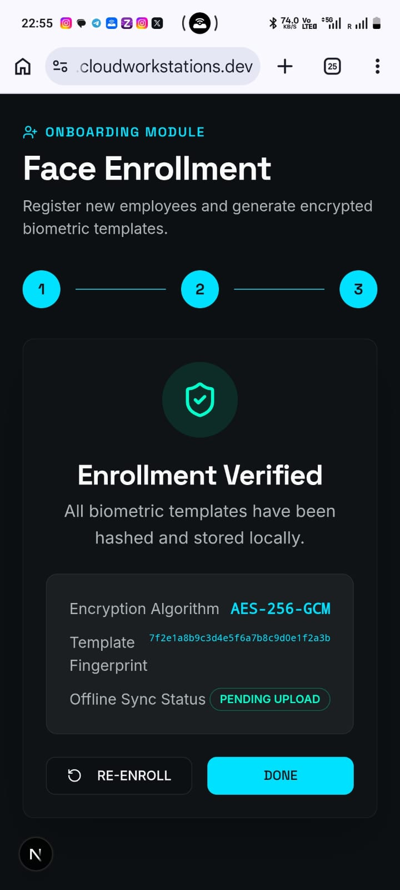
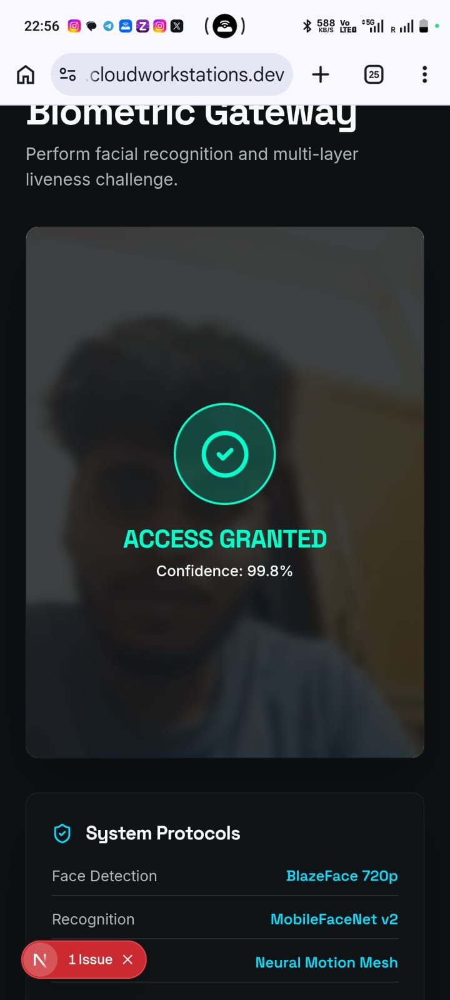
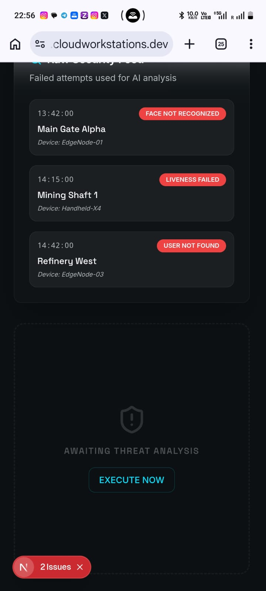

# Offline Secure Facial Recognition & Liveness Detection

An edge AI-powered biometric authentication system for NHAI Hackathon 7.0.
Works fully offline on mobile devices with anti-spoofing security and Datalake 3.0 integration.

---

## Problem Statement

### Zero-Network Zones
Mining sites, remote villages, construction sites, and disaster zones have no internet. Cloud facial recognition fails in these environments.

### Authentication Fraud
Manual attendance allows proxy attendance (buddy punching), leading to payroll fraud and safety risks.

### Privacy Risk
Cloud uploads expose face data to theft and compliance violations.

### Latency
Traditional cloud-based systems take >10 seconds — too slow for workforce operations.

## Solution Overview

100% offline authentication — all processing on-device:

| Metric | Target |
|---|---|
| Authentication Speed | <1 second |
| Accuracy | >95% |
| Model Size | ~20 MB |
| Anti-Spoofing | Blink, Smile, Head Movement |
| Platforms | Android, iOS |

---

## 7-Layer Architecture

### Layer 1 — React Native UI
User screens, instructions, authentication status display.

### Layer 2 — Camera Layer
Captures face images and frames via `expo-camera`. Latency: ~50ms.

### Layer 3 — AI Layer
| Component | Model | Purpose |
|---|---|---|
| Face Detection | BlazeFace (via InsightFace buffalo_s) | Detects facial landmarks |
| Face Recognition | MobileFaceNet | 512-D embedding generation |
| Liveness / Anti-Spoof | MiniFASNet + Custom Liveness CNN | Spoof classification |

### Layer 4 — Decision Engine
Cosine similarity comparison between live and stored embeddings. Threshold: 0.5.

### Layer 5 — Local Storage
Encrypted SQLite database stores face embeddings and authentication logs.

### Layer 6 — Sync Service
Runs only when network becomes available. Offline attendance logging with delayed cloud sync.

### Layer 7 — AWS Backend
API Gateway → Lambda → Database → Dashboard. Used for audit logs only.

---

## Operational Pipeline

| Step | Action | Details |
|---|---|---|
| 1 | Frame Capture | Open camera, capture face |
| 2 | BlazeFace Detection | 0 faces → retry, 1 face → continue, 2+ faces → reject |
| 3 | Face Embedding | MobileFaceNet creates 512-D vector (raw image deleted) |
| 4 | Liveness Challenge | Blink, Smile, Head Turn verification |
| 5 | Similarity Match | Cosine similarity against stored embedding |
| 6 | Store & Sync | Encrypt → Save → Sync later |

Total latency: ~720ms (target <1000ms)

## Latency Breakdown

| Stage | Time |
|---|---|
| Capture | 50 ms |
| Detection | 80 ms |
| Alignment | 20 ms |
| Embedding | 300 ms |
| Liveness | 200 ms |
| Matching | 50 ms |
| Logging | 20 ms |

---

## Anti-Spoofing System

### Attack Types Blocked
- Printed photo
- Screen replay (video on another device)
- Mask attack
- Cut-out photo

### Three Defense Layers

**Layer 1 — Active Challenges**: Blink, smile, head turn verification.

**Layer 2 — Passive Analysis**: Motion patterns and eye movement detection.

**Layer 3 — Spoof CNN**: MiniFASNet binary classifier (Real vs Fake).

---

## Tech Stack

| Layer | Technology | Purpose |
|---|---|---|
| Mobile Framework | React Native (Expo SDK 56) | Cross-platform Android/iOS |
| Camera | expo-camera | Live video capture |
| Face Detection | BlazeFace (via InsightFace) | Facial landmark detection |
| Face Recognition | MobileFaceNet (512-D embeddings) | Identity matching |
| Anti-Spoofing | MiniFASNet + Custom Liveness CNN | Spoof and liveness detection |
| Local Database | SQLite | Encrypted embedding and attendance storage |
| Security | AES-256 | Biometric data encryption |
| Cloud Sync | AWS (API Gateway + Lambda) | Offline attendance upload |
| Backend API | FastAPI / Uvicorn | Face processing server |
| Model Optimization | Quantization, Pruning, Distillation, Fusion | <20MB footprint |

---

## Backend API

| Endpoint | Purpose |
|---|---|
| `GET /api/health` | Backend status and model info |
| `POST /api/detect` | BlazeFace detection in uploaded image |
| `POST /api/embed` | MobileFaceNet 512-D embedding extraction |
| `POST /api/verify` | Cosine similarity match against stored embedding |
| `POST /api/spoof` | MiniFASNet anti-spoof classification |

Verify threshold: **0.5**

---

## Future Implementation

The following features are part of the product roadmap and not yet implemented in the current codebase:

### Model Optimization
- **Quantization**: FP32 → INT8 conversion for 4x model size reduction
- **Pruning**: Remove unused neural connections for 30% faster inference
- **Distillation**: Large model → small model knowledge transfer (70% reduction)
- **Fusion**: Layer fusion for 10% latency improvement
- **Target**: 17.5 MB total model footprint (current: ~100 MB InsightFace buffalo_s)

### On-Device Inference
- **react-native-fast-tflite**: Run all ML models directly on device without backend dependency
- **TFLite model conversion**: Convert all ONNX models to TensorFlow Lite format
- **Eliminate LAN requirement**: Phone operates independently without backend server

### Security Enhancements
- **Android Keystore integration**: Hardware-backed key storage
- **iOS Keychain integration**: Hardware-backed key storage
- **AES-256 encryption**: Full encryption of SQLite embeddings and attendance logs
- **TLS 1.3**: Secure sync communication when network is available

### Liveness Detection Expansion
- **Smile detection**: Active liveness challenge via smile verification
- **Depth estimation**: L4 liveness layer to block flat masks
- **Spoof CNN threshold >0.98**: Final classification confidence target
- **5-Layer Liveness**: Blink → Smile → Head Pose → Depth → Spoof CNN

### Sync & Cloud Integration
- **AWS Datalake integration**: Real API Gateway + Lambda sync (currently local-only simulation)
- **Purge-on-Sync**: Automatic deletion of synced records from device
- **Dashboard**: Web dashboard for attendance monitoring

### Authentication Enhancements
- **Multi-modal authentication**: Face + PIN combination
- **Thermal core integration**: Companion thermal imaging for body heat verification
- **Continuous learning**: On-device embedding adaptation over time
- **Predictive sync scheduling**: ML-based upload timing optimization

### Enterprise Features (v3.0)
- **Enterprise SDK** (`@datalake/offline-faceid`): Plug-and-play npm package for Datalake 3.0
- **Federated learning**: Train model improvements without sending user data
- **Multi-application support**: Single SDK serving multiple enterprise apps

### Current Limitations
- No on-device ML (requires backend server on same LAN)
- No AES-256 encryption (SQLite stores plain embeddings)
- Blink detection is UI-simulated, not actual ML-based
- Anti-spoof model file needs to be downloaded separately
- Cloud sync is local-only simulation
- All demo workers share the same face photo and embedding
- No smile detection implemented

---

## Prototype Images

| # | Screenshot |
|---|---|
| 1 |  |
| 2 |  |
| 3 |  |
| 4 |  |
| 5 |  |
| 6 |  |

---

## Setup

### Backend
```bash
cd backend
pip install -r requirements.txt
uvicorn main:app --host 0.0.0.0 --port 8000 --reload
```

Place `antispoof.onnx` in `backend/models/` for anti-spoof capability.

### Frontend
```bash
cd frontend
npm install
npx expo start --lan
```

Scan the QR code with Expo Go on your phone (same Wi-Fi network).

### Build for Device
```bash
npx expo run:android   # Android
npx expo run:ios       # iOS
```
